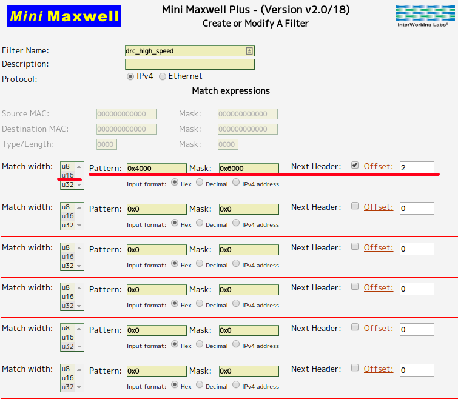

# setup minimuxwell for DRC final setting
## Set up Filter Inventory
Please click 'Flter Inventory' and create twe filters:
* `drc_high_speed`



* `drc_low_speed`


## Run test environment
```
rosrun mini_maxwell drc_2015_environment.py __ip:=IP_OF_MINI_MAXWELL
```
