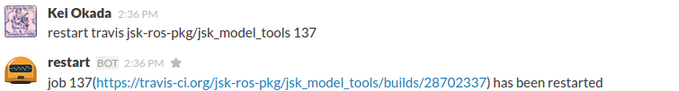
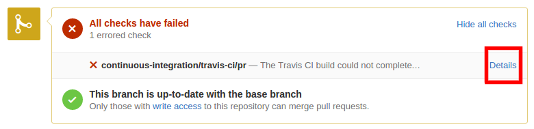
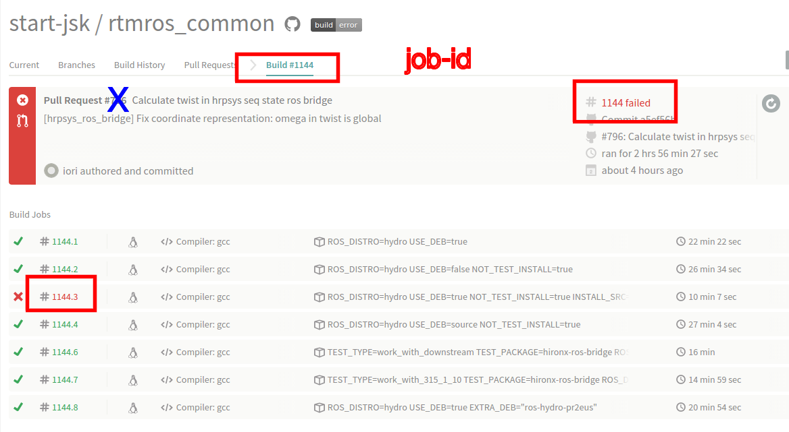
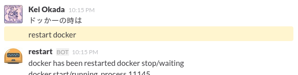

jsk_common
===

[](https://travis-ci.org/jsk-ros-pkg/jsk_common)
[](http://jsk-robotics.slack.com) 
[](https://gitter.im/jsk-ros-pkg/jsk_common?utm_source=badge&utm_medium=badge&utm_campaign=pr-badge&utm_content=badge)

Install
---
You can use `jsk.rosbuild` to setup your environment.


```sh
wget -q -O /tmp/jsk.rosbuild https://raw.github.com/jsk-ros-pkg/jsk_common/master/jsk.rosbuild
bash /tmp/jsk.rosbuild hydro
```

For hacker

```sh
wget -q -O /tmp/jsk.rosbuild https://raw.github.com/jsk-ros-pkg/jsk_common/master/jsk.rosbuild
bash /tmp/jsk.rosbuild --from-source hydro
```

For hrpsys user

```sh
wget -q -O /tmp/jsk.rosbuild https://raw.github.com/jsk-ros-pkg/jsk_common/master/jsk.rosbuild
bash /tmp/jsk.rosbuild --rtm hydro
```

For hrpsys hacker

```sh
wget -q -O /tmp/jsk.rosbuild https://raw.github.com/jsk-ros-pkg/jsk_common/master/jsk.rosbuild
bash /tmp/jsk.rosbuild --from-source --rtm hydro
```

`jsk.rosbuild` generates filesystem as follows:

```
~ --- ros
       + --- hydro_parent: Only availabe if --from-source option is enabled
              + --- src:   maintained by wstool
              + --- build: generated by catkin_tools
              + --- devel: generated by catkin_tools
       +--- hydro
             + --- src:    maintained by wstool
             + --- build:  generated by catkin_tools
             + --- devel:  generated by catkin_tools
```

Watch all the jsk github repositories.
===
Please use [this](http://jsk-github-watcher.herokuapp.com/)

Slack for JSK Lab members 
=========================
You can login to [slack](https://slack.com/) from [here](https://jsk-robotics.slack.com).
You can create account using imi address.

You can restart travis and jenkins from slack's `#travis` channel.

Restart travis from slack
-------------------------


Type `restart travis <job-id>` from slack#travis channel.

**N.B.: `<job-id>` is not the number of Pull-request.**

you can get `<job-id>` from Travis page.

- 
- 

Restart docker from slack
-------------------------


Type `restart docker` from slack#travis channel.

Deb Build Status
-----------------

hydro

- sourcedeb [](http://jenkins.ros.org/job/ros-hydro-jsk-common_sourcedeb/)
- binarydeb precise amd64 [](http://jenkins.ros.org/job/ros-hydro-jsk-common_binarydeb_precise_amd64/)
- binarydeb precise i386 [](http://jenkins.ros.org/job/ros-hydro-jsk-common_binarydeb_precise_i386/)
- binarydeb quantal amd64 [](http://jenkins.ros.org/job/ros-hydro-jsk-common_binarydeb_quantal_amd64/)
- binarydeb quantal i386 [](http://jenkins.ros.org/job/ros-hydro-jsk-common_binarydeb_quantal_i386/)
- binarydeb raring amd64 [](http://jenkins.ros.org/job/ros-hydro-jsk-common_binarydeb_raring_amd64/)
- binarydeb raring i386 [](http://jenkins.ros.org/job/ros-hydro-jsk-common_binarydeb_raring_i386/)

groovy

- sourcedeb [](http://jenkins.ros.org/job/ros-groovy-jsk-common_sourcedeb/)
- binarydeb oneiric amd64 [](http://jenkins.ros.org/job/ros-groovy-jsk-common_binarydeb_oneiric_amd64/)
- binarydeb oneiric i386 [](http://jenkins.ros.org/job/ros-groovy-jsk-common_binarydeb_oneiric_i386/)
- binarydeb precise amd64 [](http://jenkins.ros.org/job/ros-groovy-jsk-common_binarydeb_precise_amd64/)
- binarydeb precise i386 [](http://jenkins.ros.org/job/ros-groovy-jsk-common_binarydeb_precise_i386/)
- binarydeb quantal amd64 [](http://jenkins.ros.org/job/ros-groovy-jsk-common_binarydeb_quantal_amd64/)
- binarydeb quantal i386 [](http://jenkins.ros.org/job/ros-groovy-jsk-common_binarydeb_quantal_i386/)

Devel Test Status
-----------------
[Hydro](http://jenkins.ros.org/job/devel-hydro-jsk_common/) [](http://jenkins.ros.org/job/devel-hydro-jsk_common/)

[](http://jenkins.ros.org/job/devel-hydro-jsk_common/)

[Groovy](http://jenkins.ros.org/job/devel-groovy-jsk_common) [](http://jenkins.ros.org/job/devel-groovy-jsk_common/)

[](http://jenkins.ros.org/job/devel-groovy-jsk_common/)

Prerelease Test Status
----------------------

[Hydro](http://jenkins.ros.org/job/prerelease-hydro-jsk_common/) [](http://jenkins.ros.org/job/prerelease-hydro-jsk_common/) [Start Testing](http://prerelease.ros.org/create_job/hydro)

[](http://jenkins.ros.org/job/prerelease-hydro-jsk_common/)

[Groovy](http://jenkins.ros.org/job/prerelease-groovy-jsk_common) [](http://jenkins.ros.org/job/prerelease-groovy-jsk_common/)  [Start Testing](http://prerelease.ros.org/create_job/groovy)

[](http://jenkins.ros.org/job/prerelease-groovy-jsk_common/)
