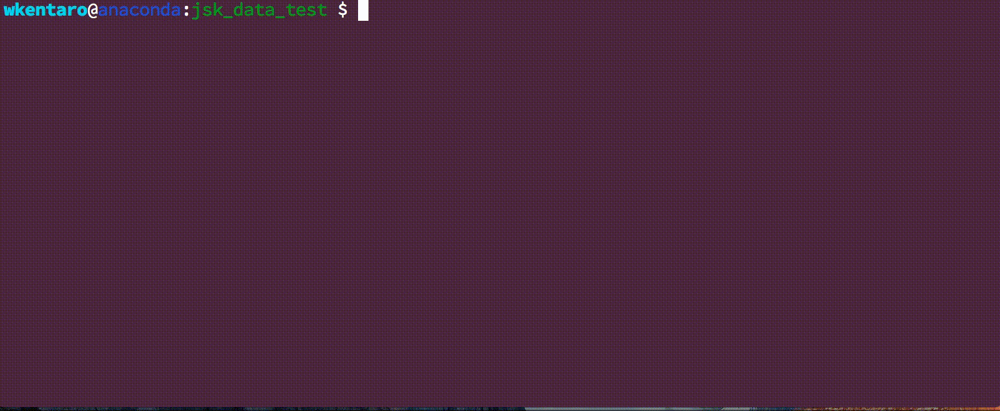

# jsk\_data command

`jsk_data` is command line interface to rename, upload and download data, and
this is fully designed for JSK lab members.
(this command communicates with internal server in lab)

There are following sub commands. See `jsk_data [sub command] --help` for more detail.

* `ls`: List data on the server.

    Usage is `jsk_data ls [OPTIONS] [QUERY]`.

* `get`: Download data from the server.

    Usage is `jsk_data put [OPTIONS] FILENAME`.

* `put`: Upload data to the server.

    Usage is `jsk_data put [OPTIONS] FILENAME`.
    With `--public` option, it also uploads to
    [public Google Drive folder](https://drive.google.com/folderview?id=0B9P1L--7Wd2vUGplQkVLTFBWcFE),
    so please care about it when you handle secure data.

* `delete`: Delete file on the server.

    Usage is `jsk_data delete FILENAME`.
    It only supports with `--public` option.
    If you want to delete private data, delete it manually by logging in aries via ssh.

* `pubinfo`: Show public data info.

    Usage is `jsk_data pubinfo [OPTIONS] FILENAME`.
    Downloading large file with `wget` or `curl` from Google Drive can be failed.
    (see [here](http://stackoverflow.com/questions/25010369/wget-curl-large-file-from-google-drive))
    Please run `sudo pip install gdown` and use it at that time. (`Usage: gdown [URL] -O [FILENAME]`)

* `pubopen`: Open Google Drive Folder where public data is uploaded

    Usage is `jsk_data pubopen`.

**Screencast**

