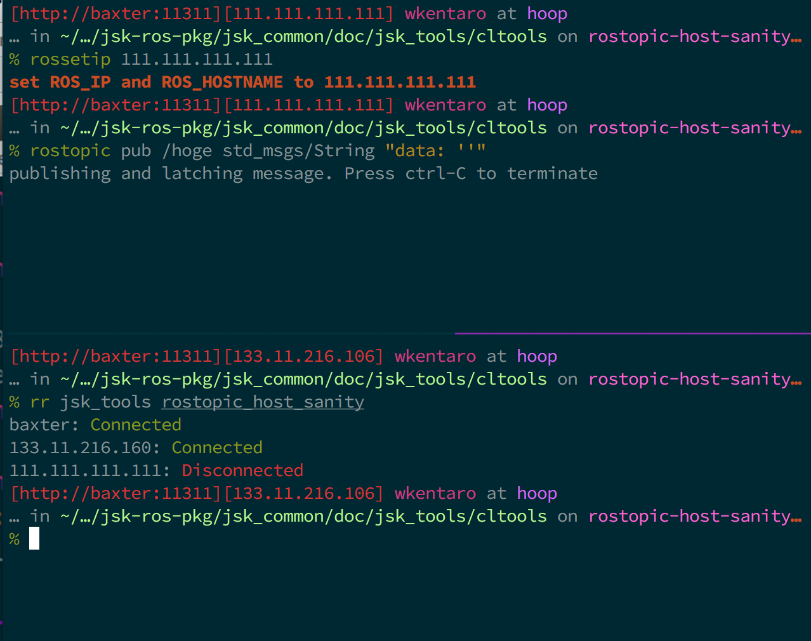

rostopic_host_sanity
====================

What is this?
-------------

Check the network connection between the local PC and each hosts
which are inside the ROS topic graph.

In above example image, ``111.111.111.111`` is non-existent IP,
and it detects the disconnected status.

Usage
-----

.. code-block:: bash

   rosrun jsk_tools rostopic_host_sanity
