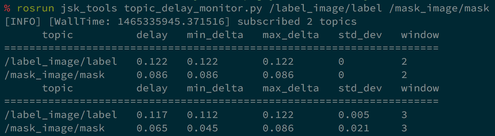

# topic\_delay\_monitor.py

This script is mostly same as [topic\_hz\_monitor.py](topic_hz_monitor.html)
but it computes the time lag from sensor input using timestamp in the header.




## Example

```bash
rosrun jsk_tools topic_delay_monitor.py /euclidean_segmentation/output --search-parent
rosrun jsk_tools topic_delay_monitor.py /euclidean_segmentation/output /camera/rgb/points
```
