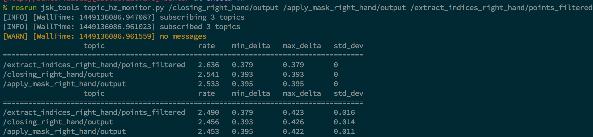

topic\_hz\_monitor.py
---------------------

This script is used to find bottleneck of topic nodes flow.
You can specify one topic and use `--search-parent` option to collect topics automatically.
(**Note** Subscribing too many topics makes it difficult to get correct result.)


**Example**
```sh
rosrun jsk_tools topic_hz_monitor.py /euclidean_segmentation/output --search-parent
rosrun jsk_tools topic_hz_monitor.py /euclidean_segmentation/output /camera/rgb/points
```
