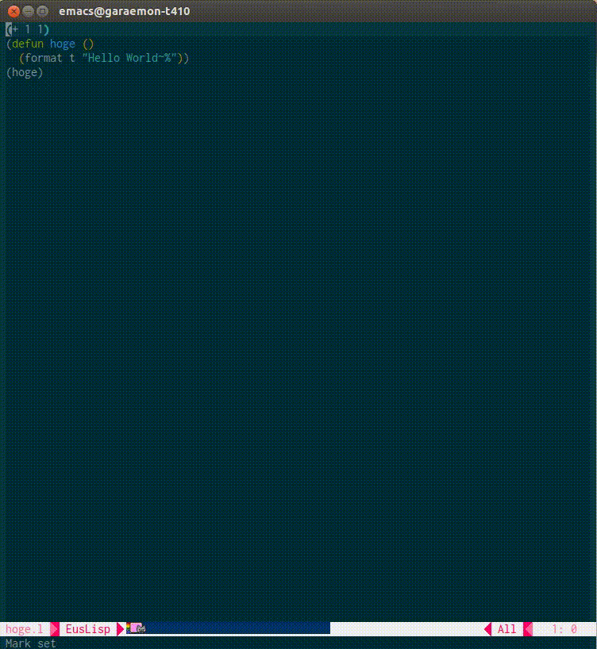

emacs
=====

We strongly recommend to use `dot.emacs` for common user.

```lisp
(load "~/ros/hydro/src/jsk-ros-pkg/jsk_common/jsk_tools/dot-files/dot.emacs")
```


## inferior-lisp-mode



inferior-lisp-mode is a classic lisp environment on emacs.
You can invoke roseus by `C-c e`.

When you use inferior-lisp-mode, you can immediately evaluate sexpression
without copy-and-paste it by `C-x C-e`.
