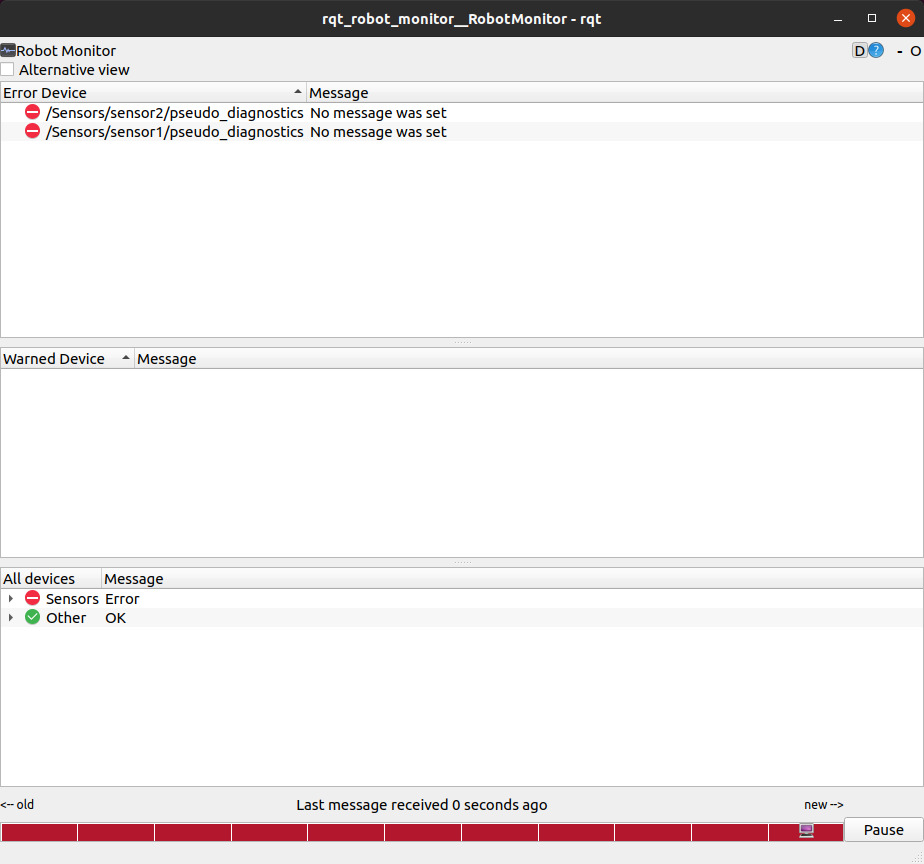

audible\_warning.py
=======================

## What is this

This is a general node that subscribes to `/diagnostics_agg` to speak the error content.
Robots using diagnostics can use this node.

## Target Action

* `/robotsound` (`sound_play/SoundRequestAction`)

    Target action name.

    If it is a different server name, please remap it like `<remap from="/robotsound" to="/sound_play" />`.

## Subscribing Topics

* `/diagnostics_agg` (`diagnostic_msgs/DiagnosticArray`)

    Aggregated diagnostics.


## Parameter

* `~speak_rate` (`Float`, default: `1.0 / 100.0`)

    Rate of speak loop. If `~wait_speak` is `True`, wait until a robot finish speaking.

* `~speak_interval` (`Float`, default: `120.0`)

    The same error will not be spoken until this number of seconds has passed.

* `~volume` (`Float`, default: `1.0`)

    Volume of speaking.

* `~language` (`String`, default: `""`)

    Language parameters for `arg2` in `sound_play/SoundRequestAction`.

* `~wait_speak` (`Bool`, default: `True`)

    If `True`, wait until finish saying one error.

* `~seconds_to_start_speaking` (`Float`, default: `0.0`)

    It is the time to wait for the node to speak after it has started.

    This is useful for ignoring errors that occur when the robot starts.

* `~wait_speak_duration_time` (`Float`, default: `30.0`)

    Waiting time in `robotsound` action.

* `~enable` (`Bool`, default: `True`)

    If `True`, speak diagnositcs. If `False`, this node don't speak.

* `~speak_ok` (`Bool`, default: `False`)

    If `True`, speak ok level diagnostics.

* `~speak_warn` (`Bool`, default: `True`)

    If `True`, speak warning level diagnostics.

* `~speak_error` (`Bool`, default: `True`)

    If `True`, speak error level diagnostics.

* `~speak_stale` (`Bool`, default: `True`)

    If `True`, speak stale level diagnostics.

* `~speak_when_runstopped` (`Bool`, default: `True`)

    If `True`, speak an error even if runstop is `True`.

* `~run_stop_topic` (`String`, default: `None`)

    Subscribe this topic if this value is specified.

* `~run_stop_condition` (`String`, default: `m.data == True`)

    Returning bool value condition using the given Python expression.
    The Python expression can access any of the Python builtins plus:
    ``topic`` (the topic of the message), ``m`` (the message) and ``t`` (time of message).

    For example, ``~run_stop_topic`` is ``robot_state (fetch_driver_msgs/RobotState)`` and if you want to check whether a runstop is a pressed, you can do the following.

    ```bash
    run_stop_condition: "m.runstopped is True"
    ```

* `~ignore_time_after_runstop_is_enabled` (`Float`, default: `0.0`)

    Time to ignore diagnostics after runstop is enabled.

* `~ignore_time_after_runstop_is_disabled` (`Float`, default: `0.0`)

    Time to ignore diagnostics after runstop is disabled.

- `~blacklist` (`Yaml`, required)

    User must always specify `name`. You can specify `message` as an option.

    These values are matched using python regular expressions.

    It is something like below:

    ```
    <!-- speak warning -->
    <node name="audible_warning"
          pkg="jsk_tools" type="audible_warning.py"
          output="screen" >
      <remap from="/robotsound" to="/sound_play" />
      <rosparam>
        run_stop_topic: robot_state
        run_stop_condition: "m.runstopped is True"
        seconds_to_start_speaking: 30
        blacklist:
          - "/CPU/CPU Usage/my_machine CPU Usage"
          - "/SoundPlay/sound_play: Node State"
          - "/Other/jsk_joy_node: Joystick Driver Status"
          - "/Other/Combined Gyro"
          - "/Other/l515_head l515_head_realsense2_camera_color: Frequency Status"
          - "/Other/l515_head l515_head_realsense2_camera_confidence: Frequency Status"
          - "/Other/l515_head l515_head_realsense2_camera_depth: Frequency Status"
          - "/Other/l515_head l515_head_realsense2_camera_infra: Frequency Status"
          - "/Other/ukf_se: Filter diagnostic updater"
          - "/Peripherals/PS3 Controller"
          - "/Sensors/IMU/IMU 1 Gyro"
          - "/Sensors/IMU/IMU 2 Gyro"
        run_stop_blacklist:
          - "\\w*_(mcb|breaker)"
          - "/Motor Control Boards/.*"
          - "/Breakers/.*"
      </rosparam>
    </node>
    ```

- `~run_stop_blacklist` (`Yaml`, optional)

    This is valid when run_stop is `True`. Blacklist at run_stop.


## Usage

Listen warnings from diagnostics.

```bash
roslaunch jsk_tools sample_audible_warning.launch
```


