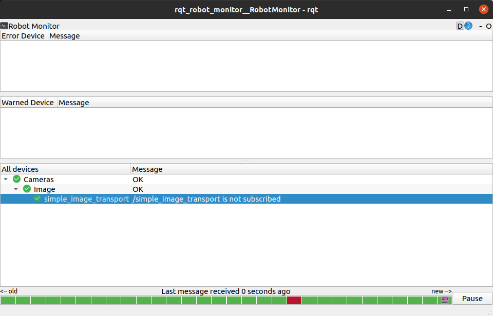
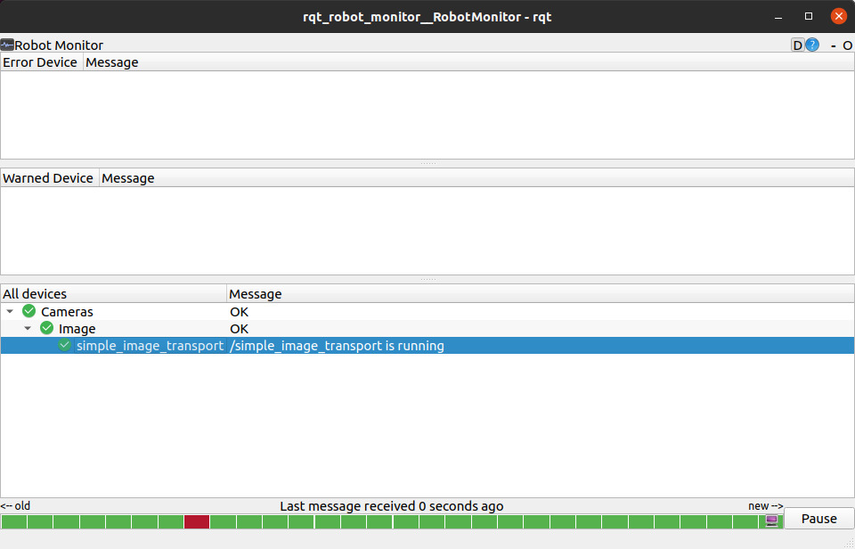
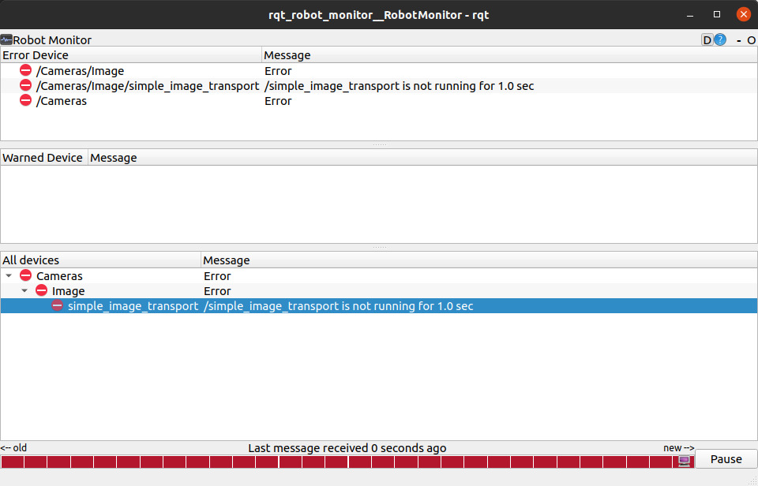

# ConnectionBasedTransport (Python)

## Description

This class is a base-class which can start subscribing topics if published topics are subscribed by the other node.
This is abstruct class.

Users inherit this class and define publisher by calling the `self.advertise` function.
The return value of `self.advertise` is the `Publisher` class. User should execute publish in `callback` function.

### For Expert

When `publish` is executed, it is judged that this node is running normally, and published `diagnostics` becomes `OK` level.
However, if the publisher is subscribed but the `publish` function is not called, the node is not working properly and `diagnostics` will be at the `ERROR` level.

Some users may execute`publish` at any time (eg `rospy.Timer`).
In that case, by executing the `self.poke` function in the callback function, the state of `diagnostics` will be `OK` level without executing publish.


## Parameter

* `~always_subscribe` (Bool, default: `false`):

  Subscribes topics even if there is no subscribers of advertised topics if `true`.

* `~enable_vital_check` (Bool, default: `true`):

  If this value is `true`, `/diagnostics` will be published and the status of whether the topic has been published will be output from this node.

* `~vital_rate` (Double, default: `1.0`):

  Rate to determine if the nodelet is in health.
  If the rate that the callback functions is below this parameter, error messages are displayed on diagnostics.
  This value is valid only if `~enable_vital_check` is `true`.

* `/diagnostic_nodelet/use_warn` or `~use_warn` (Bool, default: `False`):

  If this parameter is enabled, diagnostic messages on failure is displayed on `WARN` level instead of `ERROR` level.
  `/diagnostic_nodelet/use_warn` affects every nodelets that inherits this class, but it still can be overriden for each nodelet by setting `~use_warn` parameter.

## Publishing Topic

* `/diagnostics` (`diagnostic_msgs.DiagnosticArray`):

  Diagnostic messages. Required if `~enable_vital_check:=true`

## How does it behaves?

```bash
# terminal 1:
$ roslaunch jsk_topic_tools test_connection_based_transport.test

# terminal 2:
$ rostopic echo /simple_image_transport/output

# terminal 3:
$ rostopic info /simple_image_transport/output
Type: sensor_msgs/Image

Publishers:
 * /simple_image_transport (http://133.11.216.160:42481/)

Subscribers:
* /rostopic_137980_1496651422064 (http://133.11.216.160:38414/)

# terminal 2:
$ ^C  # cancel

# terminal 3:
$ rostopic info /simple_image_transport/output
Type: sensor_msgs/Image

Publishers:
 * /simple_image_transport (http://133.11.216.160:42481/)

Subscribers: None
```

## How to use it?

See `jsk_topic_tool/sample/simple_image_transport.py` to how to use it.

```python
import rospy

from sensor_msgs.msg import Image

from jsk_topic_tools import ConnectionBasedTransport


class SimpleImageTransport(ConnectionBasedTransport):
    def __init__(self):
        super(SimpleImageTransport, self).__init__()
        self._pub = self.advertise('~output', Image, queue_size=1)

    def subscribe(self):
        self.sub_img = rospy.Subscriber('~input', Image, self._process)

    def unsubscribe(self):
        self.sub_img.unregister()

    def _process(self, img_msg):
        self._pub.publish(img_msg)


if __name__ == '__main__':
    rospy.init_node('sample_image_transport')
    img_trans = SimpleImageTransport()
    rospy.spin()
```

## Checking the node status by diagnostics

You can check diagnostics by setting `~enable_vital_check` to `true`.

```bash
# terminal 1:
$ roslaunch jsk_topic_tools sample_connection_based_transport.launch

# terminal 2:
$ rostopic list
/diagnostics
/diagnostics_agg
/diagnostics_toplevel_state
/input
/input_dummy
/input_image
/mux/selected
/rosout
/rosout_agg
/simple_image_transport/output

# terminal 3:
$ rosrun rqt_robot_monitor rqt_robot_monitor
```

There is no one to subscribe to `/simple_image_transport/output`, so diagnostics is OK.



```bash
# terminal 4:
rostopic echo /simple_image_transport/output
```

If you subscribe to `/simple_image_transport/output`,
it will change to the diagnostics message `/simple_image_transport is running`.




```bash
# terminal 5:
rosservice call /mux/select input_dummy
```

When changing input for `simple_image_transport` by mux,
the error message will change to `/simple_image_transport is not running`.



You can check if the node is running correctly like these.
