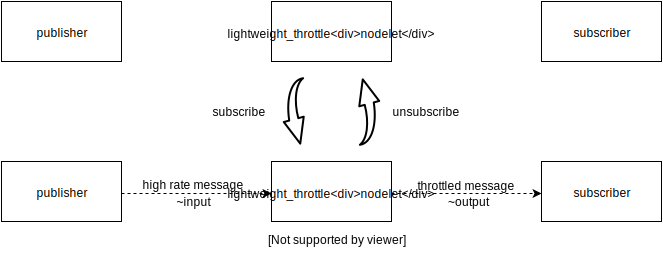

# lightweight_throttle_nodelet

## Description

This nodelet provides function like  `rosrun topic_tools throttle messages`, but subscribes high rate topic only when throttled topic is subscribed by more than equal one subscriber.

The rate of throttled message is configurable by passing `~update rate` parameter on launching this nodelet.

## Subscribing Topic
- `~input` (`AnyMsg`):

  Input topic. This topic is throttled to low publish rate.

## Publishing Topic
- `~output` (`AnyMsg`):

  Throttled topic.
  Publish rate of throttled topic is configurable by setting `~update_rate` parameter.

## Parameter
- `~update_rate` (Double, default: `1.0`):

  Publish rate of throttled message [Hz]. This parameter is updated only on launching this nodelet.
