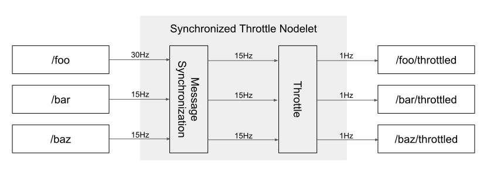

============================
SynchronizedThrottle Nodelet
============================

Description
===========

This is a nodelet for throttling like ``topic_tools/throttle``, but throttled topics are synchronized.
Unlike ``topic_tools/throttle``, this nodelet accepts parameters to specify input topics and rate for throttling.

Parameters
----------

- ``~topics`` (``String[]``, required)

  Input topics to be synchronized and throttled.

.. warning::

   This nodelet uses ``message_filters`` for message synchronization.
   ``message_filters`` limits a number of input topics to 8 at maximum.

- ``~suffix`` (``string``, default: ``throttled``)

  Suffix for advertised throttled topics.

- ``~update_rate`` (``Double``, default: ``1.0``)

  A rate for throttling messages. If this parameter is ``0.0``, no message is published.

- ``~use_wall_time`` (``Bool``, default: ``false``)

  Use wall time for throttling timer if enabled.

- ``~use_multithread_callback`` (``Bool``, default: ``true``)

  Use multithreaded node handle if enabled.

- ``~approximate_sync`` (``Bool``, default: ``false``)

  Use approximate synchronization policy if enabled, otherwise messages are published only when they are strictly synchronized.

- ``queue_size`` (``Int``, default: ``100``)

  Size of subscription queue.

