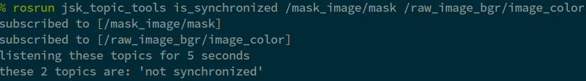

===============
is_synchronized
===============

What is this?
=============

Tool to check if specified topics are 'synchronized' or not.
'synchronized' means timestamps completely match with 'Exact' synchronization policy (default).
With 'Approximate' policy (with ``--approximate-sync`` option), it means the timestamps'
difference falls within 'slop' (default ``0.1`` seconds).

Usage
=====

.. code-block:: bash

  usage: is_synchronized [-h] [-t TIMEOUT] [-q QUEUE_SIZE] [-a] [--slop SLOP]
                         topics [topics ...]

  positional arguments:
    topics                topics which should be synchronized

  optional arguments:
    -h, --help            show this help message and exit
    -t TIMEOUT, --timeout TIMEOUT
                          Timeout for the test of synchronization
    -q QUEUE_SIZE, --queue-size QUEUE_SIZE
                          Size of queue for the synchronization
    -a, --approximate-sync
                          Flag to use approximate synchronization
    --slop SLOP           Allowed time delta in approximate synchronization

Example
=======

.. code-block:: bash

  $ rosrun jsk_topic_tools is_synchronized /mask_image/mask /mask_image/output/camera_info
  ****************** Test Condition ******************
  timeout: 5 seconds
  queue_size: 100
  topics:
    - /mask_image/mask [sensor_msgs/Image]
    - /mask_image/output/camera_info [sensor_msgs/CameraInfo]
  ****************************************************
  listening these topics for at most 5 seconds in rostime
  synchronized in 1.0 seconds
  these topics are: 'synchronized'

  $ rosrun jsk_topic_tools is_synchronized /mask_image/mask /raw_image_rgb/image_color
  ****************** Test Condition ******************
  timeout: 5 seconds
  queue_size: 100
  topics:
    - /mask_image/mask [sensor_msgs/Image]
    - /raw_image_rgb/image_color [sensor_msgs/Image]
  ****************************************************
  listening these topics for at most 5 seconds in rostime
  timeout for 5 seconds
  these topics are: 'not synchronized'
