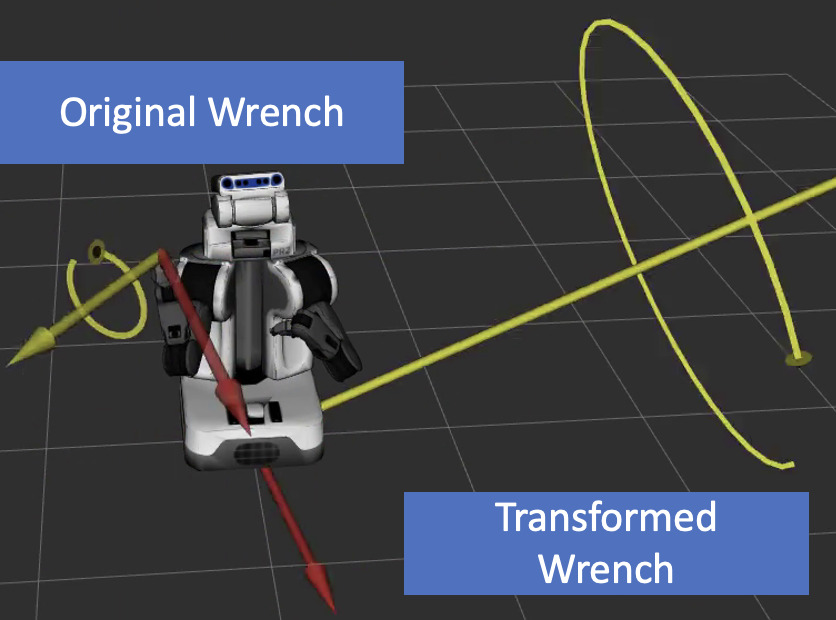

===================
transform_wrench.py
===================

What is this?
=============

Convert ``WrenchStamped`` topic with respect to ``~target_frame_id``.

Subscribing Topics
------------------

- ``~input`` (``geometry_msgs/WrenchStamped``)

  Input wrench stamped message.

Publishing Topics
-----------------

* ``~output``

  Transformed ``WrenchStamped`` topic with respect to ``~target_frame_id``.

Parameters
----------

- ``~target_frame_id`` (``String``, required)

  Reference frame of wrench.

- ``~duration_timeout`` (``Float``, default: ``0.05``)

  Duration of timeout for lookup transform.

Example
-------

.. code-block:: bash

  roslaunch jsk_topic_tools sample_transform_wrench.launch launch_robot_model:=true gui:=true
