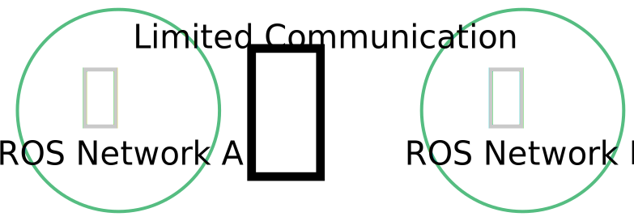
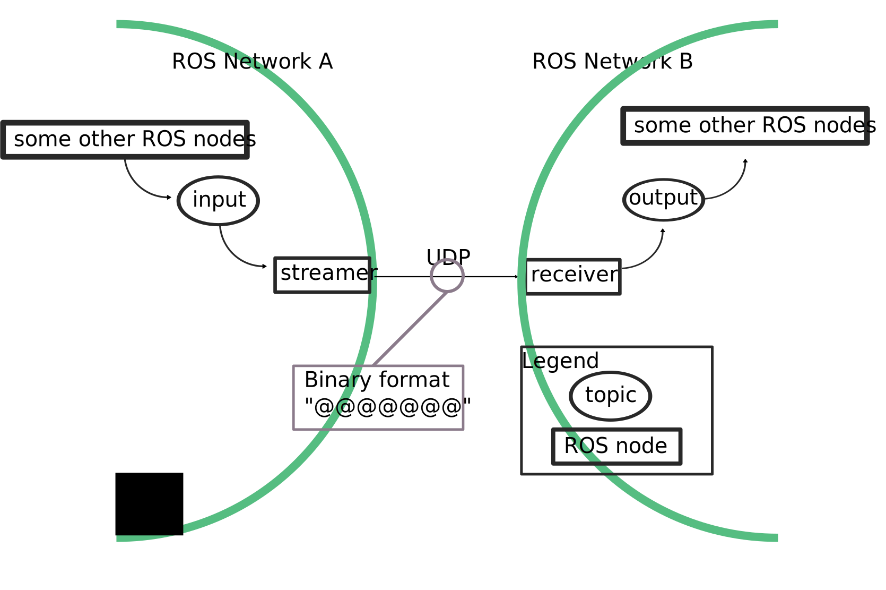
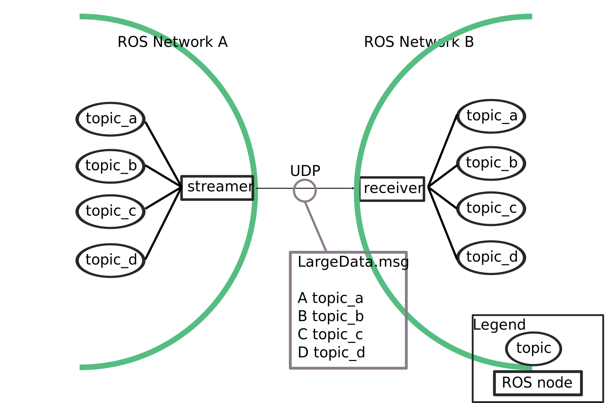

# jsk_network_tools
## Limited Network Communication.
The goal of silverhammer is to provide communication between two different ROS networks over limited network.


Currently jsk\_network\_tools supports two types of limited network model:

1. Bidirectional and narrow network.
2. Unidirectional and intermittent network.

These two models are strongly inspired by [DRC-final](http://theroboticschallenge.org/).

### Bidirectional and narrow network
jsk\_network\_tools provides `silverhammer_lowspeed_gateway.py`, which is
a gateway between two different ROS network over narrow network.



Concenpt of `silverhammer_lowspeed_gateway.py` is:

1. Use UDP prevent hand-shaking and re-sending.

  Simply use UDP protocol with fixed rate.
2. Serialize data into small format.

  Automatically generate serialization format from definition of ROS message.
  However, this serialization only supports the simplest message definition.
  Limitation of the serialization are:

  1. No nested field is allowed. Only [built-in types](http://wiki.ros.org/msg#Message_Description_Specification) are supported.
  2. No variable length array and `string` are allowed.
  3. `int8`, `duration` and `time` are not supported.

  `silverhammer_lowspeed_gateway.py` uses python [struct](https://docs.python.org/3/library/struct.html) module to serialize/deserialize messages.

### Unidirectional and intermittent network
jsk\_network\_tools provides `silverhammer_highspeed_streamer.py` and
`silverhammer_highspeed_receiver.py` to achieve high-throughput over one-way network.

These scripts does not support re-sending. Just streaming data in UDP protocol.


On this model, jsk\_network\_tools utilizes ROS serialization.
Only one limitation is that the types of the fields should be another
ROS type such as `sensor_msgs/Image`, `geometry_msgs/Pose` and so on.

The topics which streamer subscribes and receiver publishes are automatically
decided according to definition of [FC2OCSLargeData.msg](msg/FC2OCSLargeData.msg).

The rule is simple:
   Each field name represents topic name and `__` (double under scores) is
   replaced by `/`.

Streamer automatically split one big data into small UDP packets. Receiver
collects the packets and re-publish the messages to the topics.

Format of the UDP packet is:
```
    +--------+-----------+------------+-----------------+
    | Seq Id | Packet Id | Packet Num | Data ...        |
    +--------+-----------+------------+-----------------+
    |   4B   |     4B    |      4B    |                 |
    |<-------------------Staic Size--------------------->
```

* Seq Id

  Sequence Id. This is incremented when streamer sends new ROS message.
* Packet Id

  It is incremented when streamer sends new packet.
* Packet Num

  The number of the packets for receiver to decode packets.
