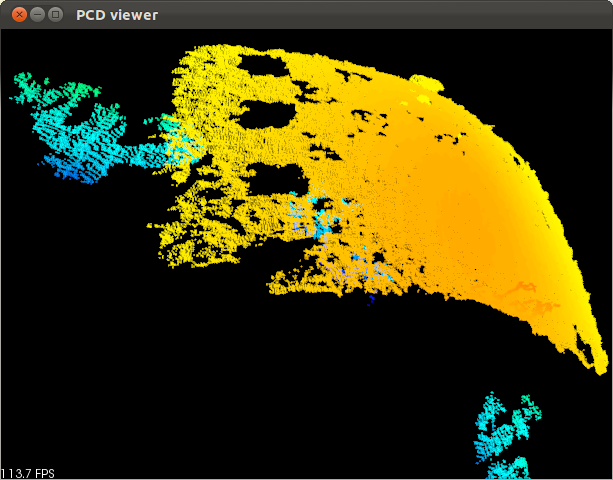
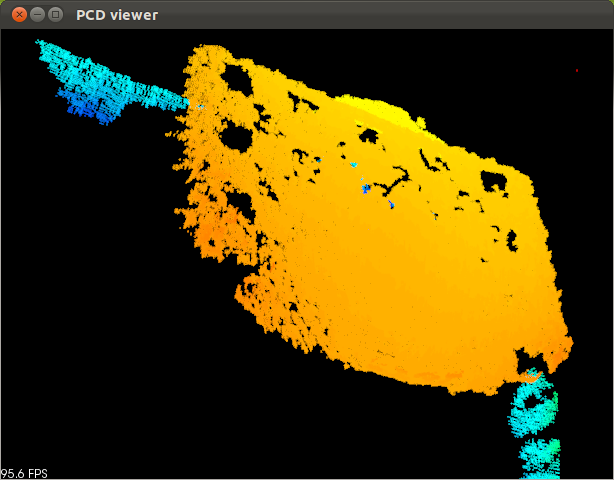
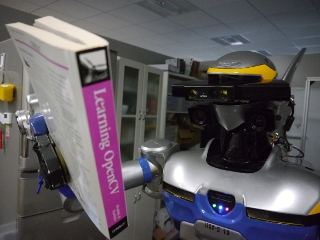
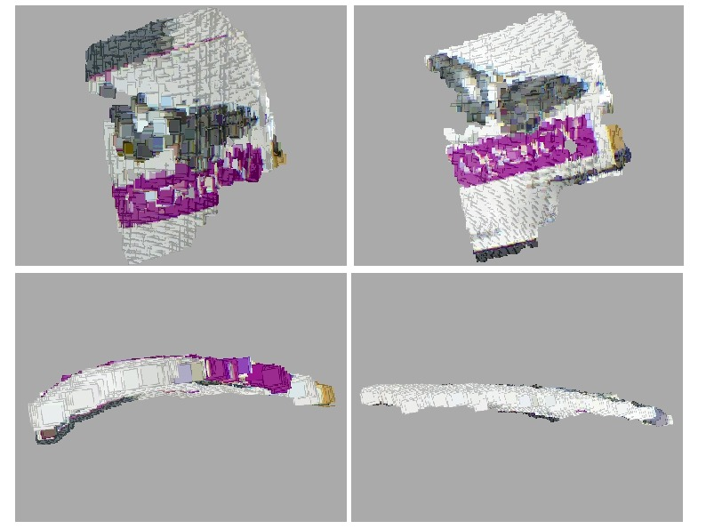

kinect_near_mode_calibration ROS Launch Files
=============================================

**Description:** kinect_near_mode_calibration

  
  
       kinect_near_mode_calibration
  
    

**License:** BSD

acquire_data.launch
-------------------

.. code-block:: bash

  roslaunch kinect_near_mode_calibration acquire_data.launch

kinect_near_mode_calibration.launch
-----------------------------------

.. code-block:: bash

  roslaunch kinect_near_mode_calibration kinect_near_mode_calibration.launch

This node is to calibrate kinect with Nyko zoom lens(http://www.nyko.com/products/product-detail/?name=Zoom).
To get more accurate depth information, we apply hyperboloid fitting for depth data.

preparation
===========

First, prepare these goods.

- kinect, primesense or xtion

- Nyko zoom lens

- a source of IR light which wavelength is about 830nm

- chessboard

- cover to shadow IR projector

prepare software
----------------

.. code-block:: bash

   svn co https://jsk-ros-pkg.svn.sourceforge.net/svnroot/jsk-ros-pkg/trunk jsk-ros-pkg
   export ROS_PACKAGE_PATH=$ROS_PACKAGE_PATH:`pwd`/jsk-ros-pkg/jsk_ros_patch/image_view_jsk_patch:`pwd`/jsk-ros-pkg/jsk_ros_patch/depth_image_proc_jsk_patch:`pwd`/jsk-ros-pkg/jsk_openni_kinect/kinect_near_mode_calibration
   rosmake kinect_near_mode_calibration

prepare hardware
----------------

- fix zoom lens to kinect. We use xtion and fix zoom lens to xtion with jig.

- fix kinect to a stable position.

- set cover to IR projector. It should be change cover state with not moving kinect.

  .. |zoom_uncover| image:: launch/img/zoom-uncovered.jpg
     :width: 400

  .. |zoom_cover| image:: launch/img/zoom-covered.jpg
     :width: 400

  +----------------------+--------------------+
  |        sample of IR projector cover       |
  +----------------------+--------------------+
  | uncover IR projector | cover IR projector |
  +======================+====================+
  |    |zoom_uncover|    |    |zoom_cover|    |
  +----------------------+--------------------+

acquire chessboard images
=========================

First, acquire images of chessboard using kinect_calibration package. You have to correct RGB, IR and depth images sets with fixing relative coordinate between kinect and chessboard. However, you cannot get these three images simultaneously. The reason is to get chessboard image in IR image, you have to light with IR light, but in IR illumination kinect cannot get IR projected pattern. Also, you cannot subscribe RGB image and IR image simultaneously.
So you have to switch two mode: RGB-Depth mode and IR mode.

modes
-----

1. RGB-Depth mode

  Switch off IR light and uncover projector.

  .. |rgb_env| image:: launch/img/rgb-depth-mode_eng_text.jpg
     :width: 300

  .. |rgb_image| image:: launch/img/img_rgb.png
     :width: 300

  .. |rgb_depth_image| image:: launch/img/img_depth_rgb.png
     :width: 300

  +------------------------------------+-------------+-------------------+
  | RGB-Depth mode environment setting |  RGB image  |    Depth image    |
  +====================================+=============+===================+
  |            |rgb_env|               | |rgb_image| | |rgb_depth_image| |
  +------------------------------------+-------------+-------------------+

2. IR mode

  Switch on IR light and cover projector. Depth image should be black since the IR projector is covered.

  .. |ir_env| image:: launch/img/ir-mode_eng_text.jpg
     :width: 300

  .. |ir_image| image:: launch/img/img_ir.png
     :width: 300

  .. |ir_depth_image| image:: launch/img/img_depth_ir.png
     :width: 300

  +-----------------------------+------------+--------------------+
  | IR mode environment setting |  IR image  |     Depth image    |
  +=============================+============+====================+
  |         |ir_env|            | |ir_image| |  |ir_depth_image|  |
  +-----------------------------+------------+--------------------+

Commands
--------

Input these commands to the terminal you launch acquire_data.launch.

- **s** : save RGB and depth image (img_rgb_{00, 01, ...}.png or img_depth_{00, 01, ..}.png) when RGB-Depth mode and IR image (img_ir_{00, 01, ...}.png) when IR mode. Images which have same index must be saved not moving chessboard and kinect.

- **i** : switch RGB-Depth mode and IR mode

- **b** : ignore current saved image of current mode. You call this command if you input **s** by mistake, or you move chessboard when you mustn't do.

Procedure
---------

1. launch nodes

  .. code-block:: bash
  
    roslaunch openni_launch openni.launch
  
  In another terminal,
  
  .. code-block:: bash

    mkdir MY_DATA_DIR
    roslaunch kinect_near_mode_calibration acquire_data.launch grid_x:=CHESS_COLUMNS_NUM grid_y:=CHESS_ROWS_NUM dir_name:=path-to-MY_DATA_DIR

2. Set chessboard to position where can be seen with both IR and RGB camera.
#. Change to RGB-Depth mode by inputting **i**, uncover projector and light off IR image.
#. Save RGB and depth image by inputting **s**.
#. Change to IR mode by inputting **i**, cover projector and illuminate chessboard with IR light.
#. Save image by inputting **s**. You must not move chessboard and kinect from saving RGB and depth image to IR image.
#. Iterate from 2 to 6 about 20 times. You should correct data in various position.

compute calibration information
===============================

We have to compute these parameters.

- IR CameraInfo

- RGB CameraInfo

- hyperboloid fitting parameters

Compute D, offset, U and V of fitting coefficients below (please refer http://www.ros.org/wiki/kinect_calibration/technical). The value (u, v) are pixels, z is depth value got from openni_driver, (cx, cy) is image center, d' is fitted disparity value.

d' = offset + D*d + U*(u-cx)^2 + V*(v-cy)^2

.. code-block:: bash

   rosrun kinect_near_mode_calibration calibrate -c CHESS_COLUMNS_NUM -r CHESS_ROWS_NUM -s CHESS_GRID_SIZE[m] path-to-MY_DATA_DIR

You can get files below inside MY_DATA_DIR:

- calibration_depth.yaml

- calibration_rgb.yaml

- kinect_params.yaml

get undistorted pointcloud
--------------------------

We attached the data we calibrate in our lab. You can try this package instantly using this calibration data.

.. code-block:: bash

   svn co https://jsk-ros-pkg.svn.sourceforge.net/svnroot/jsk-ros-pkg/trunk/jsk_ros_patch
   rosmake openni_launch_jsk_patch
   roslaunch openni_launch_jsk_patch sample_zoom.launch

If you calibrate zoomed kinect with setting output directry to MY_DATA_DIR, please create a launch file like below.

.. code-block:: bash

   cat sample_zoom.launch
   <launch>
     <include file="$(find depth_image_proc_jsk_patch)/launch/openni.launch">
       <arg name="depth_camera_info_url" value="file://(path-to-data_dir)/calibration_depth.yaml"/>
       <arg name="rgb_camera_info_url" value="file://(path-to-data_dir)/calibration_rgb.yaml"/>
       <arg name="kinect_params_url" value="(path-to-data_dir)/kinect_params.yaml"/>
     </include>
   </launch>

results
-------

+-------------------------------+------------------------------+
| Pointcloud before calibration | Pointcloud after calibration |
+===============================+==============================+
|         |before_calib|        |        |after_calib|         |
+-------------------------------+------------------------------+

   HRP-2 robot looks OpenCV book. The distance between Kinect and book is about 350mm.

   left : pointcloud of the book acquired with non-calibrated Kinect. right : pointcloud acquired with calibrated Kinect. You can find out that the distortion is improved.
  
  

Contents
########

.. code-block:: xml

  <launch>
    <arg default="8" name="rows" />
    <arg default="6" name="cols" />
    <arg default="0.108" name="size" />
    <arg default="." name="my_data_dir" />
    <node args="-r $(arg rows) -c $(arg cols) -s $(arg size) $(arg my_data_dir)" name="kinect_near_mode_calibration" pkg="kinect_near_mode_calibration" type="calibrate" />
  
    </launch>

